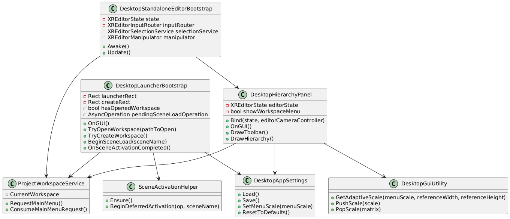
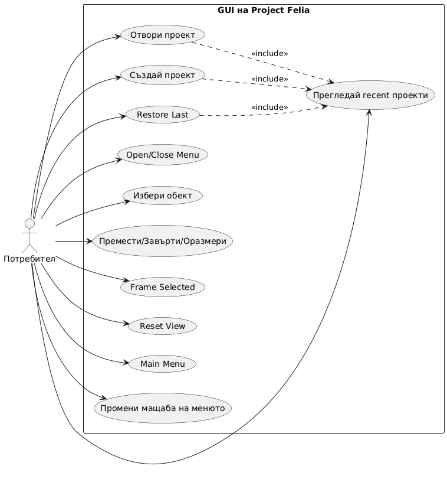
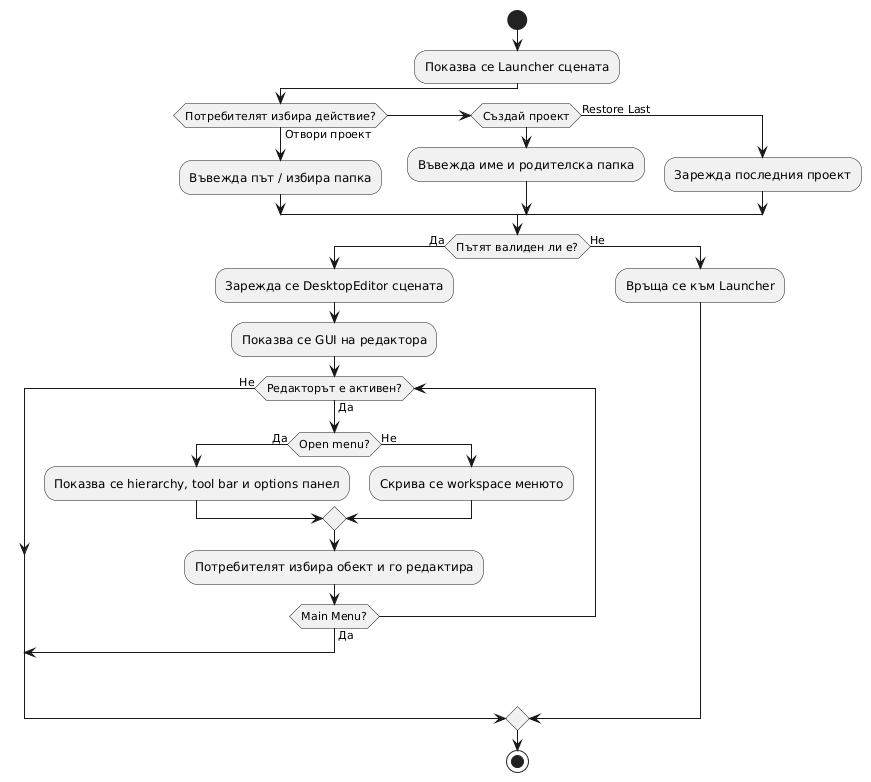
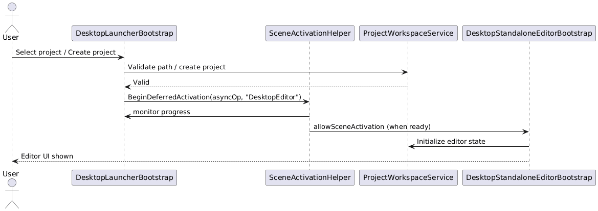

# Project Felia - десктоп редактор

Това хранилище е отправна точка за самостоятелен 3D редактор за настолен компютър, изграден с Unity и C#.

## Целеви платформи

- Windows
- macOS

## Основна структура

- Assets/Scripts/ProjectFelia/EditorXR/Core - състояние на приложението и bootstrap
- Assets/Scripts/ProjectFelia/EditorXR/Input - маршрутизиране на входа и помощни функции за показалеца
- Assets/Scripts/ProjectFelia/EditorXR/Selection - избор чрез raycast
- Assets/Scripts/ProjectFelia/EditorXR/Manipulation - начални инструменти за трансформация на обекти
- Assets/Scripts/ProjectFelia/DesktopStandalone - входната точка за десктоп build-ове

## Какво прави тази основа

- Държи логиката на редактора в обикновен C# и Unity компоненти от тип MonoBehaviour.
- Използва мишка и клавиатура като основен вход.
- Разделя избор, състояние, вход и манипулация, за да може същият код да се преизползва в различни десктоп приложения.

## Стъпки за настройка в Unity

1. Инсталирай Unity Hub и актуална LTS версия на Unity.
2. Създай нов Unity 3D проект или отвори тази папка в корена на съществуващ Unity проект.
3. Създай сцена с име Launcher за обвивката на самостоятелното приложение.
4. Добави празен GameObject с име DesktopLauncher.
5. Прикачи компонента DesktopLauncherBootstrap към този GameObject.
6. Създай втора сцена с име DesktopEditor за изгледа на редактора.
7. Добави празен GameObject с име DesktopEditorBootstrap.
8. Прикачи компонента DesktopStandaloneEditorBootstrap към този GameObject.
9. Добави компонента DesktopEditorCameraController към основната камера в сцената на редактора.
10. Добави компонента DesktopHierarchyPanel към UI host GameObject или към същия bootstrap GameObject.
11. Свържи референциите за камерата, editor bootstrap-а и hierarchy панела.
12. Постави няколко тестови обекта в сцената с collider-и, за да може raycast изборът да ги улавя.
13. Натисни Play и отвори път към проект в launcher-а, за да влезеш в сцената на редактора.

## Контроли за десктоп

- 1 за Select
- 2 за Move
- 3 за Rotate
- 4 за Scale
- Ляв бутон на мишката за избор на обект
- Esc за изчистване на избора
- A и D за завъртане на избрания обект в rotate режим
- Стрелките или WASD за преместване на избрания обект в move режим
- Page Up и Page Down за вертикално движение в move режим
- + и - за мащабиране на избрания обект в scale режим
- Main Menu връща към launcher-а
- Back to Project връща от launcher-а към активното workspace състояние
- Reset View възстановява камерата на редактора
- Десен бутон на мишката с влачене за orbit на камерата
- Среден бутон на мишката с влачене за pan на камерата
- Колелцето на мишката за zoom на камерата

## Стъпки за standalone build

1. Отвори File > Build Profiles или File > Build Settings в Unity.
2. Добави и двете сцени Launcher и DesktopEditor в build списъка.
3. Задай Launcher като първа сцена.
4. Избери Windows или macOS като целева платформа.
5. Задай build target към standalone desktop player.
6. Build и стартирай проекта, за да провериш, че приложението отваря launcher-а преди редактора.

### macOS batch build

Можеш да изградиш приложението и от командния ред:

```bash
/Applications/Unity/Hub/Editor/2022.3.22f1/Unity.app/Contents/MacOS/Unity \
	-batchmode -quit \
	-projectPath "/Users/skyfall-pc/Documents/VSC-projects/project-felia" \
	-executeMethod ProjectFeliaBuildPipeline.BuildMacOSStandalone \
	-logFile "/tmp/project-felia-build.log"
```

Изходният пакет е Builds/macOS/ProjectFelia.app.

## Отвори проект

- Стартирай приложението с -projectPath <folder>, за да отвориш директно папка с проект.
- Стартирай приложението с -projectFile <file>, за да отвориш файл на проект и да се извлече неговата папка.
- Ако не е подаден път, launcher-ът ти позволява да го въведеш преди отварянето на редактора.
- Launcher-ът запазва отворения workspace и зарежда сцената DesktopEditor.
- Launcher-ът показва списък с последни проекти и панел с информация за проекта.
- На macOS действието за избор на папка работи без да блокира основния UI thread.
- Постави файл ProjectFelia.project.json в папката на проекта, за да дефинираш project manifest.
- Launcher-ът автоматично възстановява последния отворен проект, когато е наличен.
- Използвай Restore Last, ако искаш да отвориш най-новия recent проект от launcher-а.

## Създай проект

- Използвай launcher-а, за да избереш родителска папка и да въведеш име на проект.
- Приложението създава папката на проекта, стандартните подпапки и ProjectFelia.project.json.
- Новите проекти се отварят автоматично след създаване и се добавят към recent projects.

## Windowed startup

- Самостоятелният build стартира в прозорец 1600x900.
- Player-ът използва windowed mode вместо fullscreen.
- На macOS приложението спира фоновата работа при загуба на фокус, за да избегне Command+Tab hang-ове.
- Можеш да смениш размера по подразбиране в DesktopStandaloneWindowStartup.
- Launcher-ът и hierarchy UI вече се инициализират безопасно в OnGUI, за да се избегнат freeze-ове при стартиране.
- Стартовите логове на launcher-а помагат при проследяване на проблеми с отваряне и създаване на проект.
- Менюто автоматично се мащабира според размера на екрана, за да остане четимо на различни резолюции.
- Launcher-ът и editor-ът показват GUI options панел за мащабиране на менюто и поведението при загуба на фокус.

## Диаграми на GUI

### Class диаграма

Виж [Docs/diagrams/gui-class.puml](Docs/diagrams/gui-class.puml).

Кратко: Тази диаграма показва основните класове, техните публични методи и основните зависимости между `DesktopLauncherBootstrap`, `DesktopStandaloneEditorBootstrap`, `DesktopHierarchyPanel` и помощни услуги като `ProjectWorkspaceService` и `SceneActivationHelper`.

Преглед (PNG):



Пълен вектор (SVG): [Docs/diagrams/output/gui-class.puml.svg](Docs/diagrams/output/gui-class.puml.svg)

### Use-case диаграма

Виж [Docs/diagrams/gui-use-case.puml](Docs/diagrams/gui-use-case.puml).

Кратко: Use-case диаграмата описва основните сценарии на потребителя — отваряне/създаване на проект, възстановяване на последен проект и действие върху сцената (избор и трансформация).

Преглед (PNG):



Пълен вектор (SVG): [Docs/diagrams/output/gui-use-case.puml.svg](Docs/diagrams/output/gui-use-case.puml.svg)

### Activity диаграма

Виж [Docs/diagrams/gui-activity.puml](Docs/diagrams/gui-activity.puml).

Кратко: Activity диаграмата показва потока при стартиране — Launcher -> валидация на път -> зареждане на `DesktopEditor` -> режим на редакция и връщане в Main Menu.

Диаграмите са изнесени като отделни PlantUML файлове и могат да се визуализират с PlantUML preview или външен renderer.

Преглед (PNG):



Пълен вектор (SVG): [Docs/diagrams/output/gui-activity.puml.svg](Docs/diagrams/output/gui-activity.puml.svg)

### Sequence диаграма

Виж [Docs/diagrams/gui-sequence.puml](Docs/diagrams/gui-sequence.puml).

Кратко: Последователна диаграма, която показва взаимодействието при отваряне/зареждане на проект — `DesktopLauncherBootstrap` валидация, `SceneActivationHelper` за deferred activation и `DesktopStandaloneEditorBootstrap` инициализация.

Преглед (PNG):



Пълен вектор (SVG): [Docs/diagrams/output/gui-sequence.puml.svg](Docs/diagrams/output/gui-sequence.puml.svg)

Как да рендерираш локално (macOS):

1) Инсталирай Java (ако липсва):

```bash
brew install --cask temurin
```

2) Изтегли `plantuml.jar` и рендерирай PNG/SVG:

```bash
mkdir -p Docs/diagrams/output
curl -L -o plantuml.jar https://github.com/plantuml/plantuml/releases/latest/download/plantuml.jar
java -jar plantuml.jar -tpng -o Docs/diagrams/output Docs/diagrams/*.puml
java -jar plantuml.jar -tsvg -o Docs/diagrams/output Docs/diagrams/*.puml
```

<!-- EOF -->